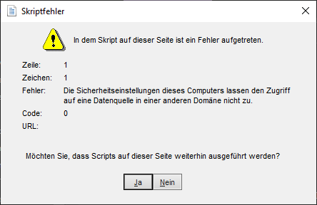

# Gleitzeitkonto-Browser - Anzeigen der Überstunden per Erweiterung

Die Browser Erweiterung, die das aktuelle Gleitzeitkonto mit Hilfe der [Gleitzeitkonto-API](https://github.com/julius-boettger/gleitzeitkonto-api) anzeigt. Man muss nicht mehr umständlich die Überstunden ausrechnen oder aus PDF-Datein ablesen. Es werden einfach im Fiori-Launchpad auf der Seite der Zeiterfassung die aktuellen Überstunden angezeigt, ebenfalls im Popup-Menu der Erweiterung selber.
Alternativ: [Gleitzeitkonto-Desktop](https://github.com/julius-boettger/gleitzeitkonto-desktop)
<br><br>
*Das Gleitzeitkonto im Fiori-Launchpad:*
<br>


> ### 🚨 Disclaimer
> Dies ist **keine offizielle Software** und auch nicht in irgendeiner Form mit Fiori oder SAP verbunden! Es gibt **keine Gewährleistung** für die Richtigkeit der Überstunden!

# Installation (Windows)
Bisher wurde alles nur auf Windows getestet! Andere Systeme sind daher nur experimentell.

1. <b>Webserver installieren <i>(automatisch)</i></b><br>
   **[Installations-Skript](https://github.com/NilsPvR/Gleitzeitkonto-Browser/releases/download/v1.1.1/install_Gleitzeitkonto-Browser-GUI.hta)** herunterladen und ausführen.

<details><summary><b>❓ Es kommt eine Fehlermeldung</b></summary>
    <details><summary><b>Fehler:</b> "Erlaubnis verweigert"</summary>
        <i>Die Fehlermeldung sieht folgendermaßend aus:</i><br>
        
        <br><br>
        <p>Die Fehlermeldung taucht auf, wenn der Antivirus, die Datei noch nicht vollständig überprüft und frei gegeben hat. Eine solche Überprüfung passiert automatisch und kann leider einige Zeit dauern.<p>
        <p>Mit Admin Rechten kann diese Überprüfung übersprungen werden.</p>
        <ol>
            <li>"Windows-Sicherheit" öffnen</li>
            <li>"Viren- & Bedrohungsschutz"</li>
            <li>Unter "Einstellungen für Viren- und Bedrohungsschutz": "Einstellungen verwalten"</li>
            <li>Unter "Ausschlüsse" (weit unten): "Ausschlüsse hinzufügen oder entfernen"</li>
            <li>"Ausschluss hinzufügen"</li>
            <li>"Ordner"</li>
            <li><code>%UserProfile%\AppData\Local\Programs</code> in der Adressleite eingeben</li>
            <li>Ordner "Gleitzeitkonto-Browser" auswählen</li>
            <li>"Ordner auswählen"</li>
            <li>Der Antivirus ignoriert nun den Installations-Ordner und das Programm kann ausgeführt werden.
                <ol>
                    <li>Hierzu "Windows-Taste" + "R" (gleichzeitig) drücken</li>
                    <li><code>%UserProfile%\AppData\Local\Programs\Gleitzeitkonto-Browser</code> eingeben </li>
                    <li>"start-Gleitzeitkonto-Webserver.vsb" ausführen</li>
                </ol>
            </li>
        </ol>
    </details>
    <details><summary><b>Fehler:</b> "Die Sicherheitseinstellungen des Computers..."</summary>
        <i>Die Fehlermeldung sieht folgendermaßen aus:</i><br>
        
        <br><br>
        <ol>
            <li>Installations-Programm schließen</li>
            <li>Rechtsklick auf die Datei (Installations-Skript) -> Eigenschaften</li>
            <li>Unter Sicherheit: Häckchen bei "Zulassen" setzen -> OK<br>
                
            </li>
            <li>Installation erneut starten</li>
        </ol>
    </details>

</details>
<br><br>

2. **Erweiterung hinzufügen**<br>
Die Erweiterung muss im entsprechenden Browser installiert werden: [Firefox](https://github.com/NilsPvR/Gleitzeitkonto-Browser/wiki/Firefox-Installation) oder [Chrome](https://github.com/NilsPvR/Gleitzeitkonto-Browser/wiki/Chrome-Installation) oder [Edge](https://github.com/NilsPvR/Gleitzeitkonto-Browser/wiki/Edge-Installation)
3. Fertig! 🥳
<hr>

## 1. Webserver manuell (alternativ)
Gleitzeitkonto-Browser kann auch manuell installiert werden, falls eine automatische Installation nicht gewünscht ist. Die Dateien, die unter [releases](https://github.com/NilsPvR/Gleitzeitkonto-Browser/releases) nicht heruntergeladen werden sollen müssen hierfür heruntergeladen werden. Bei vorhandener Node.js Installation kann die webserver-script.zip, ansonsten die webserver.zip Datei, heruntergeladen werden. Die Dateien nun in ein gewünschtes Verzeichnis extrahieren. Bei der Skript-Version [erweiterte Schritte](#experten---nodejs-webserver) beachten.<br>
Das vbscript "start-Gleitzeitkonto-Webserver" kann dazu verwendet werden um den Webserver zu starten. Es kann hierfür eine Verknüpfung erstellt werden, um diese in den Autostart zu legen.

Für die Erweiterung muss die entsprechende .zip oder .xpi Datei heruntergeladen werden. Für Chromium-Browser muss die zip Datei entpackt werden. Für Firefox die .xpi Datei unverändert lassen. Die Dateien können in ein beliebiges Verzeichnis gelegt werden. Anschließend [Hinzufügen der Erweiterung](#2-hinzufügen-der-erweiterung) folgen, mit angepasstem Pfad.
<br><br>

## Node.js-Skript Webserver
Diese Schritte nur folgen, wenn bei der Installation "Hintergrund-Node.js-Skript" ausgewählt wurde. Zunächst muss [Node.js](https://nodejs.org/) zusammen mit npm auf dem PC installiert sein. Falls Node.js erst nach der Installation installiert wird, am besten die Installation erneut durchführen. <br>
Damit der Hintergrund-Prozess (Webserver) funktionieren kann, muss eine URL hinzugefügt werden:
1. "Windows-Taste" + "R" (gleichzeitig) drücken
2. `%UserProfile%\AppData\Local\Programs\Gleitzeitkonto-Browser\Webserver` eingeben
3. Die Datei "url.json" öffnen
4. Zwischen die Anführungszeichen den Link zur "Meine Zeitenübersicht"-Seite im internen Fiori eingeben. Es sollte dann ungefähr so aussehen:
   ```"https://abc.cdef.domain.com:1234/bla/bla/bla#btccatstime-display"```
5. Speichern + Schließen
6. Im selben Ordner "start-Gleitzeitkonto-Webserver.vbs" ausführen, um den Webserver zu starten
7. Der Webserver sollte nun unter [http://localhost:35221](http://localhost:35221) erreichbar sein

# Funktionsweise

Die Gleitzeitkonto-API (wird zur Berechnung benötigt) verwendet [Node.js](https://nodejs.org/). Eine Browser-Erweiterung, bzw. einfach ein Javascript Skript im Browser, hat jeodch keinen Zugriff auf lokale Dateien auf dem Computer und kann auch keine Node-Scripts laufen lassen. Aus diesem Grund ist es nicht möglich direkt auf die API zuzugreifen. Um die Daten von der API zu erhalten muss ein Hintergrund-Programm (ein lokaler Webserver) eingerichtet werden. Ein Webserver ist eine Webseite wie "wikipedia.org" nur läuft diese lokal, auf dem PC. Der Webserver verwendet die API und stellt die Daten dann über Webrequests (Aufrufe der Seite) zur Verfügung. Dies kann auch nachvollzogen werden indem die [lokale Seite](http://localhost:35221) aufgerufen wird. <br>
Zur Funktionsweise der API kann die [README](https://github.com/julius-boettger/gleitzeitkonto-api#readme) des repos gelesen werden.<br>
Die Browser-Erweiterung ruft den lokalen Webserver auf und erhält hierüber die Daten zum Gleitzeitkonto. Diese werden dann im Popup und auf der Fiori-Seite angezeigt. Die Browser-Erweiterung kann also nicht ohne das Hintergrund-Programm / den Webserver funktionieren.

Der Webserver muss kontinuierlich im Hintergrund laufen. Es ist leider nicht möglich, um den Webserver nur bei Bedarf von der Browser-Erweiterung heruas zu starten. Für den Webserver läuft ein Hintergrund Prozess, den man im Task-Manager unter "Details" mit dem Namen "Gleitzeitkonto-Webserver.exe" bzw. "node.exe" finden kann. Hierzu wird normalerweise ca. 20 - 40 MB RAM verbraucht. Solange der Webserver nicht aufgerufen wird, wird jedoch die CPU nicht (nur minimal) verwendet.<br>

# Idee
Das Gleitzeitkonto-Projekt (API, Dekstop und Browser) ist enstanden, da es keine einfache Möglichkeit gab die Überstunden einzusehen. Dies ist relevant, wenn man in manchen Wochen mehr als die geforderte Wochenstundenzahl arbeitet und in der anderen Woche entsprechend weniger arbeiten möchte.
