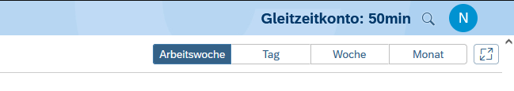

# Gleitzeitkonto-Browser - Anzeigen der Überstunden per Extension

Die Browser Extension, die das aktuelle Gleitzeitkonto mit Hilfe der [Gleitzeitkonto-API](https://github.com/julius-boettger/gleitzeitkonto-api) anzeigt. Man muss nicht mehr umständlich die Überstunden ausrechnen oder aus PDF-Datein ablesen. Es werden einfach im Fiori-Launchpad auf der Seite der Zeiterfassung die aktuellen Überstunden angezeigt. Ebenfalls ist es möglich die Überstunden im Popup-Menu der Extension selber einzusehen.
  
*Das Gleitzeitkonto im Fiori-Launchpad:*
 

Das Gleitzeitkonto-Projekt ist enstanden, da es keine einfache Möglichkeit gab die Überstunden einzusehen. Dies ist relevant, wenn man in manchen Wochen mehr als die geforderte Wochenstundenzahl arbeitet und in der anderen Woche entsprechend weniger arbeiten möchte.

> ### 🚨 Disclaimer
> Die Extension ist noch in der **BETA Phase**, es fehlen viele Features und wenig ist ordentlich dokumentiert. Dies ist **keine offizielle Software** und auch nicht in irgendeiner Form mit Fiori oder SAP verbunden! Es gibt **keine Gewährleistung** für die Richtigkeit der Überstunden!

## Installation

## Funktionsweise

Die Gleitzeitkonto-API verwendet [Node.js](https://nodejs.org/). Eine Browser-Extension, bzw. einfach ein Javascript Script im Browser, hat jeodch keinen Zugriff auf lokale Dateien auf dem Computer und kann auch keine Node-Scripts laufen lassen. Aus diesem Grund ist es nicht möglich direkt auf die API zuzugreifen. Um die Daten von der API zu erhalten muss ein lokaler Webserver eingerichtet werden. Der Webserver verwendet die API und stellt die Daten dann über Webrequests zur Verfügung. Dies kann auch nachvollzogen werden indem die lokale Seite aufgerufen wird. Zur Funktionsweise der API kann die [README](https://github.com/julius-boettger/gleitzeitkonto-api#readme) des repos gelesen werden. 
Die Browser-Extension ruft den lokalen Webserver auf und erhält hierüber die Daten zum Gleitzeitkonto. Diese werden dann im Popup und auf der Fiori-Seite angezeigt. Die Browser-Extension kann also nicht ohne den Webserver funktionieren.

Der Webserver muss kontinuierlich im Hintergrund laufen. Hierzu wird RAM verbraucht:  
- Powershell: ca. 35 MB
- CMD: ca. 26 MB  
- CMD ohne GUI/Hostfenster: ca. 20 MB

Solange der Webserver nicht aufgerufen wird, wird auch nicht bzw. nur minimal die CPU verwendet.