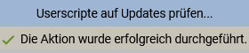

Primitive Anleitung zur Einrichtung

1. Tempermonkey-Erweiterung installieren
2. Neues Script erstellen mit folgenden Code
```
// ==UserScript==
// @name         Fiori-Stunden-Github
// @namespace    http://tampermonkey.net/
// @version      0.1
// @author       NilsPvR
// @description  Überstunden einfügen in Fiori
// @icon         https://www.google.com/s2/favicons?sz=64&domain=tampermonkey.net
// @match        *://*.ondemand.com/*
// @require      https://gist.githubusercontent.com/NilsPvR/8b67d8f2cda09f394a13bd902f6a4655/raw/tempermonkey-ueberstunden.js

// ==/UserScript==
```

**das hier ist besser**

```
// ==UserScript==
// @name         Fiori-Stunden-Lokal-Github
// @namespace    http://tampermonkey.net/
// @version      0.1
// @author       NilsPvR
// @description  Überstunden einfügen in Fiori
// @icon         https://www.google.com/s2/favicons?sz=64&domain=tampermonkey.net
// @updateURL    https://gist.githubusercontent.com/NilsPvR/8b67d8f2cda09f394a13bd902f6a4655/raw/tempermonkey-ueberstunden.js
// @downloadURL  https://gist.githubusercontent.com/NilsPvR/8b67d8f2cda09f394a13bd902f6a4655/raw/tempermonkey-ueberstunden.js
// @match        *://*.ondemand.com/*

// ==/UserScript==
```
3. Script-Einstellungen: "Starte wenn:" -> "document-start"  
        "Nach Updates suchen" Haken setzen

4. Einstellungen von Tampermonkey öffnen und "Userscript Update" -> "Check Interval" einstellen auf bevorzugtes Upate verfahren
5. "Installierte Userscripte" -> Skript "Fiori-Stunden-Lokal-Github" auswählen, Aktion "Aktualisieren" auswählen -> "Start"<br>
Sollte so aussehen:<br>
