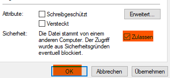

# Gleitzeitkonto-Browser - Anzeigen der Überstunden per Erweiterung

Die Browser Erweiterung, die das aktuelle Gleitzeitkonto mit Hilfe der [Gleitzeitkonto-API](https://github.com/julius-boettger/gleitzeitkonto-api) anzeigt. Man muss nicht mehr umständlich die Überstunden ausrechnen oder aus PDF-Datein ablesen. Es werden einfach im Fiori-Launchpad auf der Seite der Zeiterfassung die aktuellen Überstunden angezeigt, ebenfalls im Popup-Menu der Erweiterung selber.
Alternativ: [Gleitzeitkonto-Desktop](https://github.com/julius-boettger/gleitzeitkonto-desktop)
  
*Das Gleitzeitkonto im Fiori-Launchpad:*
 

> ### 🚨 Disclaimer
> Dies ist **keine offizielle Software** und auch nicht in irgendeiner Form mit Fiori oder SAP verbunden! Es gibt **keine Gewährleistung** für die Richtigkeit der Überstunden!

# Installation (Windows)
Bisher wurde alles nur auf Windows getestet! Andere Systeme sind daher nur experimentell.
1. **[Node.js](https://nodejs.org)** mit npm installieren
2. **[Installations-Skript](https://github.com/NilsPvR/Gleitzeitkonto-Browser/releases/latest/download/install_Gleitzeitkonto-Browser-GUI.hta)** herunterladen
3. **Downloads** Ordner öffnen -> **Rechtsklick** auf die Datei (Installations-Skript) -> **Eigenschaften** 
 
4. Unter Sicherheit: Häkchen bei "**Zulassen**" setzen -> OK 
 
5. Skript ausführen (Doppelklick)

<b>❓ Es kommt eine Fehlermeldung</b>

    

<b>Fehler:</b> "Die Sicherheitseinstellungen des Computers..."

        <i>Die Fehlermeldung sieht folgendermaßen aus:</i> 
        
          
        <ol>
            <li>Installations-Programm schließen</li>
            <li><b>Rechtsklick</b> auf die Datei (Installations-Skript) -> <b>Eigenschaften</b> 
                
            </li>
            <li>Unter Sicherheit: Häkchen bei "<b>Zulassen</b>" setzen -> OK 
                
            </li>
            <li>Installation erneut starten</li>
        </ol>
    

  

6. **Erweiterung hinzufügen** 
Die Erweiterung muss im entsprechenden Browser installiert werden: [Firefox](https://github.com/NilsPvR/Gleitzeitkonto-Browser/wiki/Firefox-Installation) oder [Chrome](https://github.com/NilsPvR/Gleitzeitkonto-Browser/wiki/Chrome-Installation) 
❗ Edge wird leider nicht als Browser unterstützt.
7. Fertig! 🥳 *(Probleme? Erstelle ein [Issue](https://github.com/NilsPvR/Gleitzeitkonto-Browser/issues))*

## Manuell installation (alternativ)
Gleitzeitkonto-Browser kann auch manuell installiert werden, falls eine automatische Installation (siehe Schritte oben) nicht gewünscht ist. 
1. [Node.js](https://nodejs.org) mit npm installieren
2. Die Dateien, die unter [releases](https://github.com/NilsPvR/Gleitzeitkonto-Browser/releases) nicht heruntergeladen werden sollen müssen hierfür heruntergeladen werden. Für die CompanionApp "NICHT-Herunterladen-win-x64-companionApp.zip" herunterladen. Die Dateien in ein gewünschtes Verzeichnis extrahieren.
3. Es muss ein Registry Eintrag hinzugefügt werden, damit der Browser die CompanionApp findet *(Pfad entsprechend anpassen)*: 
    

Firefox

    <pre><code>REG ADD "HKEY_CURRENT_USER\Software\Mozilla\NativeMessagingHosts\gleitzeitkonto_browser_companionapp" /ve /t REG_SZ /d "PFAD_ZUM_ORDNER\CompanionApp\manifest.json" /f</code></pre>
    

    

Chrome

    <pre><code>REG ADD "HKEY_CURRENT_USER\Software\Google\Chrome\NativeMessagingHosts\gleitzeitkonto_browser_companionapp" /ve /t REG_SZ /d "PFAD_ZUM_ORDNER\CompanionApp\manifest-chromium.json" /f</code></pre>
    

4. Für die Erweiterung muss die entsprechende .zip oder .xpi Datei heruntergeladen werden. Für Chromium-Browser muss die .zip Datei entpackt werden. Für Firefox die .xpi Datei unverändert lassen. Die Dateien können in ein beliebiges Verzeichnis gelegt werden. Anschließend [Erweiterung hinzufügen](#installation-windows) folgen, mit angepasstem Pfad.
5. Fertig! 🥳 *(Probleme? Erstelle ein [Issue](https://github.com/NilsPvR/Gleitzeitkonto-Browser/issues))*
  

# Deinstallation
Zum Deinstallieren von Gleitzeitkonto-Browser und der CompanionApp können folgende Schritte befolgt werden:
1. Das [Deinstallations-Skript](https://github.com/NilsPvR/Gleitzeitkonto-Browser/releases/latest/download/uninstall_Gleitzeitkonto-Browser-GUI.hta) herunterladen und ausführen. 
2. Die Erweiterung aus dem Browser entfernen ([Firefox](https://support.mozilla.org/de/kb/addons-deaktivieren-oder-deinstallieren), [Chrome](https://support.google.com/chrome_webstore/answer/2664769?hl=de))
3. (optional) Node.js deinstallieren

# Funktionsweise

Die Gleitzeitkonto-API ermöglicht das berechnen des Gleitzeitkontos. Die API verwendet hierfür [Node.js](https://nodejs.org/). Eine Browser-Erweiterung, bzw. einfach ein JavaScript-Skript im Browser, hat jedoch keinen Zugriff auf lokale Dateien auf dem Computer und kann auch keine [Node.js](https://nodejs.org/)-Skripte laufen lassen. Aus diesem Grund ist es nicht möglich, direkt auf die API zuzugreifen. Zur Funktionsweise der API kann die [README](https://github.com/julius-boettger/gleitzeitkonto-api#readme) des Repos gelesen werden. 
Um die Daten von der API zu erhalten, muss ein natives Programm eingerichtet werden. In diesem Fall die CompanionApp. Die CompanionApp verwendet das [Native Messaging](https://developer.mozilla.org/en-US/docs/Mozilla/Add-ons/WebExtensions/Native_messaging) Verfahren, um mit der Browser-Erweiterung zu kommunizieren und die Daten sicher weiterzugeben. 

In älteren Versionen wurde ein Webserver verwendet, der kontinuierlich im Hintergrund laufen musste. Native Messaging ermöglicht es, die CompanionApp nur bei Bedarf durch den Browser starten zu lassen. 

# Idee
Das Gleitzeitkonto-Projekt (API, Dekstop und Browser) ist enstanden, da es keine einfache Möglichkeit gab, die Überstunden einzusehen. Dies ist relevant, wenn man in manchen Wochen mehr als die geforderte Wochenstundenzahl arbeitet und in der anderen Woche entsprechend weniger arbeiten möchte.
